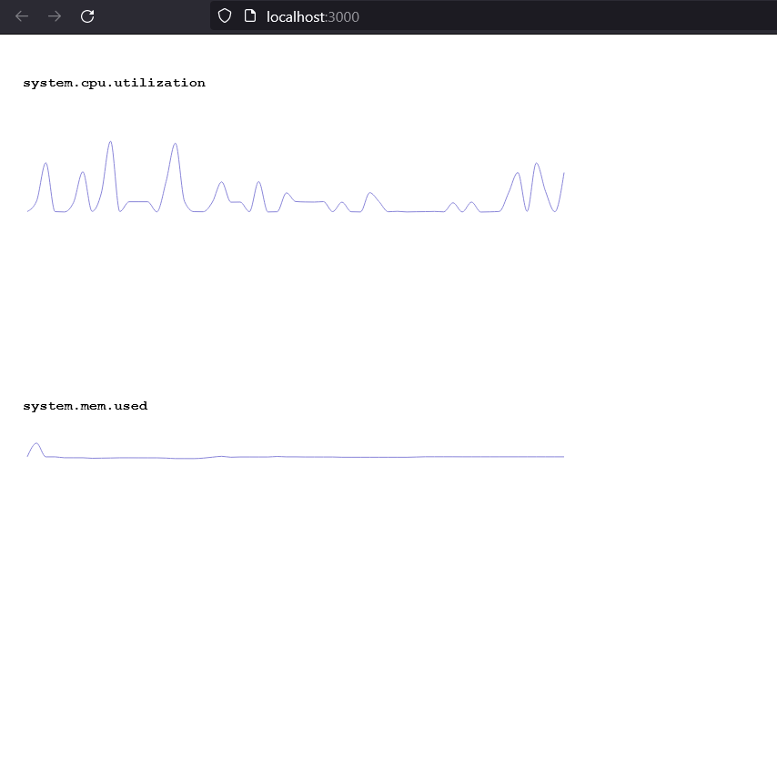

# Metrics Cat

A self-hosted metrics, logs and APM solution with a free license.

## Local development

This will help you setup Metrics Cat locally!

### Requirements

1. PostgreSQL 10 or higher,
2. [nvm](https://github.com/nvm-sh/nvm),
3. latest [Rust](https://rust-lang.org).

### Setup

1. `createdb metrics` to create the Postgres database used by the app,
2. `cargo build` to download the dependencies and build the app,
3. `cargo install sqlx-cli && sqlx migrate run --database-url=postgres:///metrics` to run migrations.

This app consists of three components:

- agent that collects the metrics,
- server that serves the API,
- frontend (React) which makes this look good.

In three different terminal tabs, run this individually:

1. `cargo run server`,
2. `cargo run agent`,
3. `cd metricscat-frontend && nvm install && nvm use && npm install && npm start`.

You should see the metrics appear in your browser!

